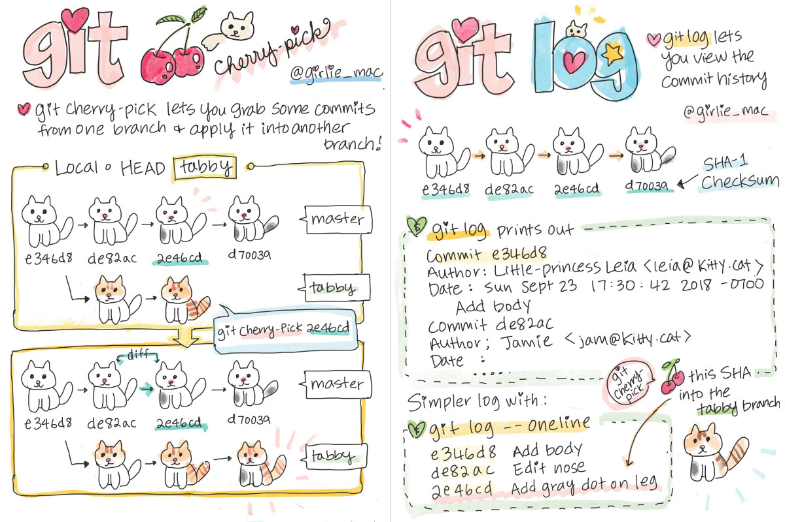

# Начало работы с git

## Начало работы с репозиторием

> git init

Команда, которая создает локальный репозиторий

Если вы до этого не воодили имя/почту, то нужно их ввести

> **git config --global user.name Имя - один раз вводим логин  
> **git config --global user.mail some@mai.com

## Добавление изменений

Для того, чтобы начать отслеживать изменения в файле именем file_name:

> git add file_name

И чтобы зафиксировать все файлы, которые мы отслеживаем:

> git commit -m "some message"

## Дополнительные команды добавления к отслеживанию

Особенно если работает только с одним файлом. Чтобы не печатать название файла, можно ввести команду "добавить все". Это можно сделать несколькими способвами:

> git add .

> git add --all

> git add -A

*Нужно запомнить, что перед сокращением всегда стоит одно тире -*

*Перед тэгом два тире --*

Чтобы удалить из добавленной группы один файл, пишем:

> git restore --staged file_name

Для удаления всех:

> git restore --staged .

Чтобы добавить все файл одного расширения к отслеживанию:

> git add *.txt (любое расширение)

## Дополнительные команды отслеживания

Также можно обойтись без команды git add, особенно если работаем с одним файлом. Если уже создали файл и хотя бы единожды добавляли его с git add для отслеживания, то дальше можно обойтись командой -a

> git commit -a -m "some message"

Тэг -а добавляет все несохраненные отслеживаемые файлы.

Их можно апределить по команде **git status** по статусу **changes not staged for commit**. По этой же команде мы модем определить несохраненные неотслеживаемые файлы.

При ошибке в комментарии последнего комита, можно вызвать текстовый редактор командой:

> git commit --amend

## Отслеживание состояния репозитория

> git status

Показывает состояние репозитория, то есть файлы, которые были доавлены в репозиторий или изменены. Также показывает, какие файлы готовы к комиту

> git log

Показывает историю комитов

> git diff

Показывает разницу медлу текущим состоянием файлов и тем, что отслеживается

## Переход между комитами

Можно перейти в к прошлым комитам с помощью команды

> git checkout commit_code

commit_code - код комита. который можно посмотреть в git log

Чтобы вернуться к актуальному комиту, нужно ввести

> git checkout master

Чтобы узнать больше о команде, пишем название команды и тэг —help. Напр.:

> git add --help

## Добавление картинок

Картинки добавляются через , где [] - текст в случае, если картнка не загрузится, а () - relative path картинки, помещенной с ту же папку, что и документ

## Удаление веток

Для удаление ветки branch_name нужно ввести:

> git branch -d branch_name

Она удалится, если нет никаких ошибок.

Если хотим удалить ветку, несмотря на ошибки, то вводим:

> git branch -D branch_name

## Ветки

Чтобы увидеть все ветки документа, нужна команда:

> git branch

Чтобы создать новую ветку:

> git branch branch_name

Чтобы переключиться на новую ветку:

> git checkout branch_name

## Удаление веток

Для удаление ветки branch_name нужно ввести:

> git branch -d branch_name

Она удалится, если нет никаких ошибок.

Если хотим удалить ветку, несмотря на ошибки, то вводим:

> git branch -D branch_name

## Слияние веток и разрешение конфликтов

Для того, чтобы слить ветку branch_name в текущую, нужно ввести:

> git merge branch_name

При возникновении конфликта при merge, нужно выбрать самостоятельно, какой из вариантов нам нужен (или оставить оба) и при необходимости изменить их.

## Справка

Для того, чтобы вызвать справку по какой-то из команд, нужно дописать к ней тэг --help

> git add --help

> git commit --help

> git merge -- help
Вливать ветки нужно в главную ветку мастер. Тогда вся утвержденная актуальная информация оказывается в главной ветке. 

Можно и наоборот - влить ветку мастер в любую второстепенную. Это помогает актуализировать ее и поможет избежать конфликтов при слиянии. 

## Работа с удаленным репозиторием
При работе с Git в команде принято использовать удаленный репозиторий. Один из самых популярных из них - Github.

Там создается аккаунт, где можно создавать и хранить репозитории с информацией. Что можно делать с этими репозиториями?

## 1. Брать чужие репозитории в свой локальный

Это делается командой 

**git clone (ссылка на репозиторий с github)**

Предварительно лучше создать под это папку. Команду **git init** выполнять в ней НЕ нужно.

### Что скажет git status после клонирования?

Он выдаст фатальную ошибку, потому что мы все еще находимся в своей папке без репозитория. 

Чтобы перейти в репозиторий, скачанный с гитхаб, нужно ввести команду

**cd (название нужной папки)**

Теперь можно вносить любые изменения в файлы этого репозитория.

Чтобы вернуться обратно наверх, вводим

**cd ..**

Также чтобы увидеть терминал документа, жмем правой кнопкой и

**Open integrated terminal**

## 2. Заливать свой репозиторий в гитхаб

Для этого создаем свой локальный репозиторий с нужными файлами, все, как обычно.

Далее нам нужен наш аккаунт на гитхаб, который сам подскажет три варианта создания нового репо. Предварительно через плюсик в верхнем правом углу создаем новую папку.
Нам нужен второй вариант. Просто последовательно вводим эти команды в свой терминал.

В первый раз гитхаб попросит залогиниться.

В итоге мы увидим все наши файлы на страничке гитхаба.

Каждое следующее изменение текста дозаливаем с помощью команды

**git push**

Также мой коллега может производить изменения данного файла на своем компьютере и заливать его на гитхаб. Тогда мы наоборот - обновляем свой вариант, заливая его с сайта. 

**git pull** - она не только добавляет новое, но и сливает merge два варианта документов.

Кстати, можно внести изменения и на самом гитхабе. Внизу страницы там есть окошко для создания комита.

Все комиты на сайте смотрим по кнопке **History**.

## Второй способ присоединения

Хорош тем, что вместе с документом мы добавляем всю историю комитов.

1. Создаем репозиторий на Github
2. Копируем ссылку https
3. Вводим

**git remote add origin ссылка на удаленный репозиторий**

1. Проверяем, вводим

**git remote**

Должен высветиться статус origin. Но git status все еще показывает, что мы на ветке мастер, и она ни с чем не связана.

1. Отправляем наш файл в удаленный репозиторий. В первый раз это делается командой

**git push —set-upstream origin master**

Теперь git status покажет, что мы на ветке мастер, и она связана с веткой origin.

Эта же команда нам понадобится, если мы создали на локальном репозитории новую ветку и хотим закинуть ее на удаленный репозиторий.

## А можно поучаствовать в чужом проекте?

Да. Для этого нужно предложить изменения в чужой документ. Предварительно нужно скопировать чужой репозиторий в свой, а со своего - в свой локальный. 

Жмем на кнопку **fork** на странице интересующего нас репозитория

Теперь он полностью скопирован  в наш аккаунт. Теперь отсюда можно склонировать к себе в локальный репозиторий.

Далее в локальном создаем в этом репозитории новую ветку.

После введения нужных изменений нужно предложить эти изменения владельцу основного репозитория.

Для этого пушим изменения сначала на наш удаленный репозиторий

**git push**

Затем появляется кнопка **Compare and pull request**. Жмем.

В ответ Гитхаб проверит, можно ли слить две версии без конфликта, а также предложит добавить описание и комментарий.

## Работа с удаленным репозиторием
При работе с Git в команде принято использовать удаленный репозиторий. Один из самых популярных из них - Github.

Там создается аккаунт, где можно создавать и хранить репозитории с информацией. Что можно делать с этими репозиториями?

## 1. Брать чужие репозитории в свой локальный

Это делается командой 

**git clone (ссылка на репозиторий с github)**

Предварительно лучше создать под это папку. Команду **git init** выполнять в ней НЕ нужно.

### Что скажет git status после клонирования?

Он выдаст фатальную ошибку, потому что мы все еще находимся в своей папке без репозитория. 

Чтобы перейти в репозиторий, скачанный с гитхаб, нужно ввести команду

**cd (название нужной папки)**

Теперь можно вносить любые изменения в файлы этого репозитория.

Чтобы вернуться обратно наверх, вводим

**cd ..**

Также чтобы увидеть терминал документа, жмем правой кнопкой и

**Open integrated terminal**

## 2. Заливать свой репозиторий в гитхаб

Для этого создаем свой локальный репозиторий с нужными файлами, все, как обычно.

Далее нам нужен наш аккаунт на гитхаб, который сам подскажет три варианта создания нового репо. Предварительно через плюсик в верхнем правом углу создаем новую папку.
Нам нужен второй вариант. Просто последовательно вводим эти команды в свой терминал.

В первый раз гитхаб попросит залогиниться.

В итоге мы увидим все наши файлы на страничке гитхаба.

Каждое следующее изменение текста дозаливаем с помощью команды

**git push**

Также мой коллега может производить изменения данного файла на своем компьютере и заливать его на гитхаб. Тогда мы наоборот - обновляем свой вариант, заливая его с сайта. 

**git pull** - она не только добавляет новое, но и сливает merge два варианта документов.

Кстати, можно внести изменения и на самом гитхабе. Внизу страницы там есть окошко для создания комита.

Все комиты на сайте смотрим по кнопке **History**.

## Второй способ присоединения

Хорош тем, что вместе с документом мы добавляем всю историю комитов.

1. Создаем репозиторий на Github
2. Копируем ссылку https
3. Вводим

**git remote add origin ссылка на удаленный репозиторий**

1. Проверяем, вводим

**git remote**

Должен высветиться статус origin. Но git status все еще показывает, что мы на ветке мастер, и она ни с чем не связана.

1. Отправляем наш файл в удаленный репозиторий. В первый раз это делается командой

**git push —set-upstream origin master**

Теперь git status покажет, что мы на ветке мастер, и она связана с веткой origin.

Эта же команда нам понадобится, если мы создали на локальном репозитории новую ветку и хотим закинуть ее на удаленный репозиторий.

## А можно поучаствовать в чужом проекте?

Да. Для этого нужно предложить изменения в чужой документ. Предварительно нужно скопировать чужой репозиторий в свой, а со своего - в свой локальный. 

Жмем на кнопку **fork** на странице интересующего нас репозитория

Теперь он полностью скопирован  в наш аккаунт. Теперь отсюда можно склонировать к себе в локальный репозиторий.

Далее в локальном создаем в этом репозитории новую ветку.

После введения нужных изменений нужно предложить эти изменения владельцу основного репозитория.

Для этого пушим изменения сначала на наш удаленный репозиторий

**git push**

Затем появляется кнопка **Compare and pull request**. Жмем.

В ответ Гитхаб проверит, можно ли слить две версии без конфликта, а также предложит добавить описание и комментарий. Добавляем, отправляем.

## Ссылки доп информации по работе с git:

[Git для новичков (часть 1)](https://habr.com/ru/post/541258/)

[Git для новичков (часть 2)](https://habr.com/ru/post/542616/)